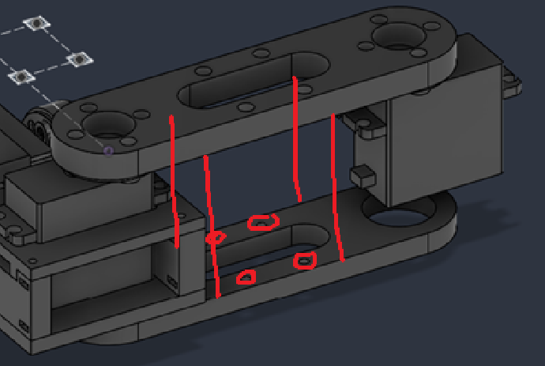
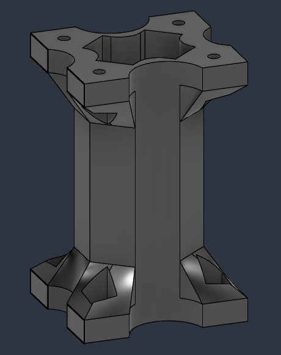
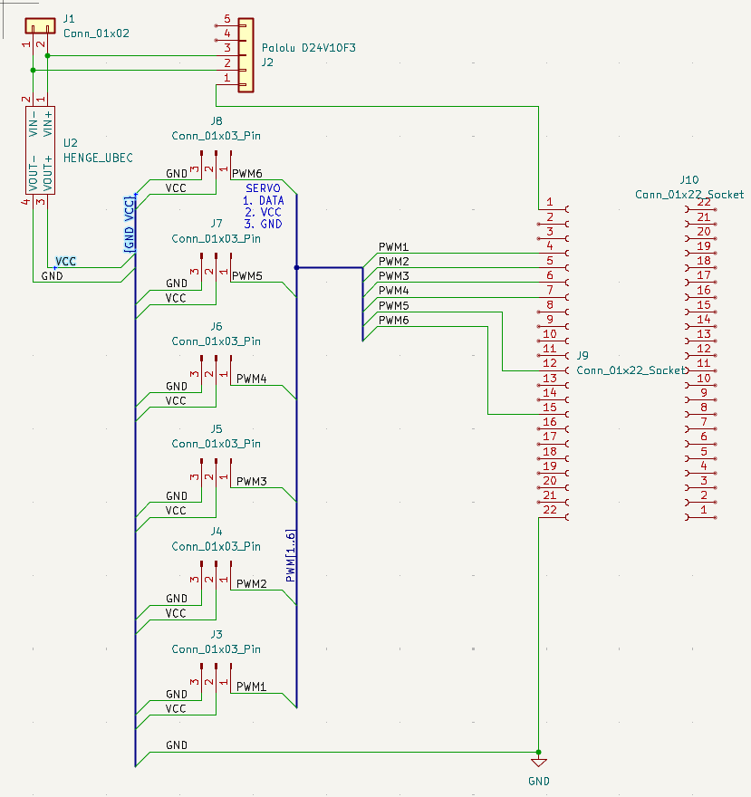
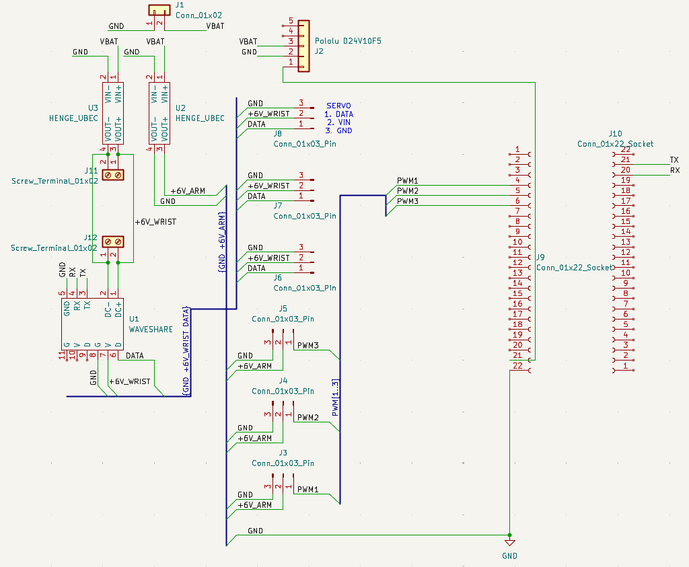
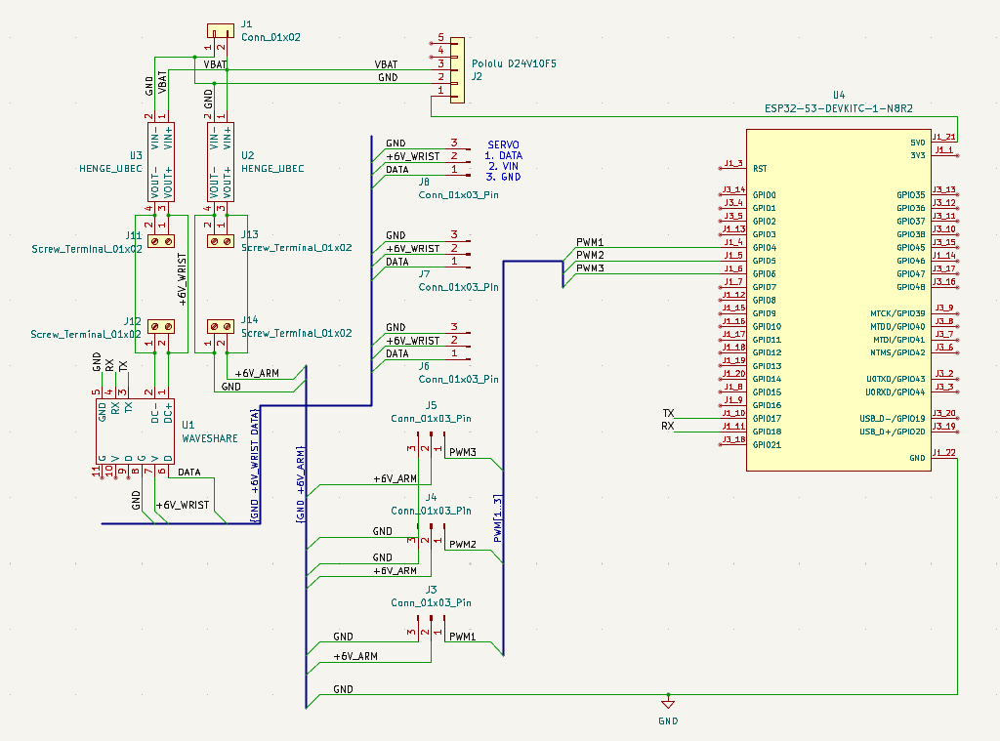
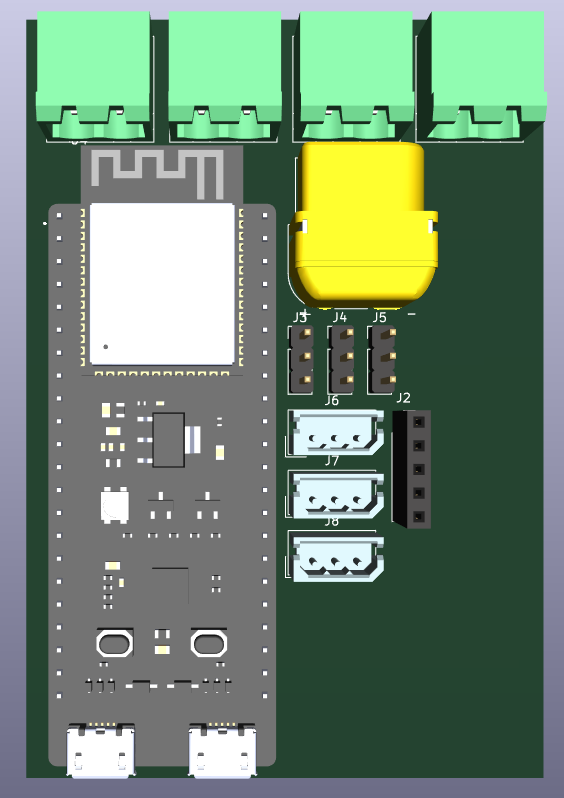

# December 29, 2024: Beginning the project

About a week ago, as winter break approached, I decided that I wanted to do a personal project for myself, to motivate chronic bum Logan to go out there and build something pretty cool, which is kind of why I pursued engineering in the first place. Now, after a week of bumming around, have I decided to begin. Now I begin to document my journey in building this and hopefully by the end of it, I'll have a super cool robot that I can show off (maybe to colleges?) (but also because it's cool).

So here's the gist of the idea I have:


I want to have the two robots work together. Maybe one's a bit stronger and has the platform to carry the robot with the arm. Or maybe I have two identical robots; that way their functions are interchangeable.

# January 1, 2025: Research links

Just adding some links for research:

[How to design and make a robot](https://www.youtube.com/watch?v=lKxJUViQsW8)

You know, designing a robot from scratch might be a really hard thing to do.

[Cool robot idea](https://www.reddit.com/user/KIKAItachi/)

# February 3, 2025: Leg and frame research

Been a long time since I came to this project, and now I'm doing research as to how I could possibly do this. ChatGPT is the new Google, you know, so not cheating.

Notes:

Lowkey the design we go for, and also figured out the design for what the legs should look like.


Hoping to figure out what the frame might look like and go from there. My next job should probably be figuring out what electronics I should be purchasing (servos, sensors, etc.). I should especially be worried about which sensors I would ACTUALLY NEED TO USE IN ORDER TO MAINTAIN SPIDER BALANCE.

# March 21-23, 2025: Beginning with one leg

Returned to this project and read up on how one would do this. The first step is to begin with a single-leg mechanism.

New Leg Design (ratios 0.6:1:1.6) (it's 1.6 instead of 2 because the arm is curved)


Look at how cute this is! Will be awesome when bro gets made.

March 23rd:

Just did a ton of research on what steps to take next. I haven't gotten around to starting the CAD, but I'm pretty sure I know of what servos to use. As part of servo research, I took this hand off of a Meccano robot I found in order to help me visualize how the leg would look.


Given that each servo is around 5.5cm at its widest + a couple of centimeters in order to build the housings, the coxa is at least ~14cm long. My ratios then have the femur as around ~23cm, and my tibia at around ~35cm (end to end, probably around ~38 actual length.

# March 30, 2025: Starting the servo CAD

I began CADing the servo motor; also, the servos themselves came in! Beautiful.


(Figuring out the dimensions was the hard part. I'm sure this will look nicer eventually.)

# April 3, 2025: Wiring and purchasing plan

At this point I know what I'm doing; exactly how to wire it, and what I need to purchase.

Arduino Nano, 7.4V 2S LiPo batteries, and now I just need to 3D print.

[OVONIC 2S LiPo battery](https://www.amazon.com/OVONIC-Battery-Trucks-Vehicles-Packs/dp/B0CHM2R7QJ)

# July 3, 2025: Working circuit and servo-holder redesign

It's been a while since I've revisited this doc, but I have plenty of updates to add!

I've purchased the batteries, and over these last few months, I created a working circuit for the prototype leg! I've been told that my design for the servo holder was lacking, so I'm revisiting it to redesign and hopefully print it soon.

The circuit


V2 of the servo holder


# July 23, 2025: Setting a concrete timeline

Exactly twenty days later and 0 progress has been made lol. So now, we're going to set some concrete timelines/project goals.


Here's to finishing it by September!

Hopefully, I can have a good design leg by next Wednesday.

Materials to purchase

- [2-56 square nuts](https://www.mcmaster.com/94855A279/)
- [2-56 screws](https://www.mcmaster.com/92949A079/)
- [M4 hex nuts](https://www.mcmaster.com/90591A255/)
- [M4 screws](https://www.mcmaster.com/92095A192/)
- [Servo hub](https://www.servocity.com/plastic-servo-hub-h25t-spline-32mm-diameter/)

# August 7, 2025: Full leg CAD and inverse kinematics

Big strides have been made. I've CAD-ed the entire leg, and it should be printed (and hopefully assembled) by next week. Now I take on the monumental task of creating the code and implementing inverse kinematics into the leg.

[Inverse Kinematics of Articulated Manipulator](https://www.youtube.com/watch?v=D93iQVoSScQ) - Used this to help determine the inverse kinematics


Volume of Leg:

- 1.883E+05 mm^3 - Tibia
- 92287.084 mm^3 - Femur
- 3152.098 mm^3 - Servo Hub (3)

Leg CAD:


Here's a snippet of some of the prototype Code:

```cpp
float t1 = atan2(y, x) * 180.0 / M_PI + 90;

p3 = acos(constrain((r3 * r3 - a2 * a2 - a3 * a3) / (-2.0 * a2 * a3)));

float t3 = 180.0 - (p3 * 180.0 / M_PI) - off;

p1 = acos(constrain((a3 * a3 - a2 * a2 - r3 * r3) / (-2.0 * a2 * r3)));

p2 = atan2(r2, r1);

float t2 = (p1 - p2) * 180.0 / M_PI;
```

Let's see if this works when I assemble everything next week.

# August 2025 - July 2026

During this period I put this project on the backburner, and worked on the project sporadically throughout my senior year.

But essentially, I:
- fixed my CAD design of the leg so that I could actually assemble it
- went through the trouble of assembling the leg
- vibe coded a controller that built off of my IK (inverse kinematics) math
- put it into action!


Here's also everything I've obtained that hasn't been mentioned already:

[Bearings](https://www.amazon.com/dp/B0G34JLXLK)

[DS3235 35KG Servo](https://www.amazon.com/dp/B07SBYZ4G5/)

Arduino Due (I swiped it from school)

**Total time spent: 60 hours** (somewhere between 60-100 hours from December 2024 - July 2026. I know this probably won't be counted but y'know, atleast know a lot of time was put into it)

# Change of Plans

In early July, I realized that the hexapod idea I've been working with over the past year and a half wouldn't be feasible. Why? Most other hexapods used much smaller and lighter mini-servos if they used servos. However, at the scale my servos were at, a robot of relative size would place too heavy a load on the servos, which aren't well-suited to repeatedly lifting that much weight while walking. So with the possibility that the robot I'd eventually build might not work because physics, I believed continuing the project in its current state wasn't possible. Either I:
1. abandon the project
2. spend a boatload buying smaller servos (and designing new parts), or
3. a secret third option of pivoting with what I had already built to still make something really cool.

# July 19, 2026

Originally, I came up with two new projects: a robot arm on wheels, or a teleoperated robot arm, a fancy way to say that I'm making a fancy joystick to control a robot arm. I settled on the Robot (arm) On Wheels (ROWBot) first, but then I realized that it was basically a worse version of a bomb disposal robot, and figured I had a better use for the teleoperated robot arm. So I spent some time researching how they worked and what I would need to do to make it a reality. (if you want to steal the ROWBot name go for it)


For one, my 3-DOF leg needs to become a 5/6-DOF arm, meaning I need 2/3 more (smaller) servos to act as the wrist, as well as something to actuate the gripper itself. In order to implement the 'teleoperated' portion of the project, I'm going to use 5/6 rotation servos to build a smaller model of the robot arm that would serve as the controller. The arm would mimic the controller's movements. Additionally, I'd use two microcontrollers like the ESP32 to communicate between controller and arm. Now that I think about it, I might not need the Arduino if I can just use the ESP32 instead, but that's something I'll look into later.


I also went and spent some time redesigning the (now arm) 3D parts for the leg, making it easier to assemble as well as making it structurally better.


**Total time spent: 7 hours**

# July 20/21, 2026

I'm about to board a plane as I'm typing this...

But basically, once again, I just spent a embarrassingly crap ton of time CAD-ing the model for the follower arm. I like to think that I'm getting both faster and better at designing because of my experience designing the original flaming pile of junk robot leg, but still... 7 hours for a handful of parts feels slow. Also gotta stop doing these late-night CAD sessions and fix my sleep schedule.

Here's the femur:


Parts of the base:


Total progress of the leg now:


**Total time spent: 7 hours**

# July 29 + 31, 2026

I'm lazy when it comes to working on this project and even lazier when it comes to writing up journal entries T_T

Over those two days I worked on building a connector for the two femur pieces, something I'd forgotten to do in my leg prototype (see a few entries ago to see that I used tape to hold them together). Here's the vision:



It's designed to not use supports when I print it, as the outer parts for the nuts have a <45 degree overhang.

Here's that part:



**Total time spent: 3 hours**

# August 2, 2026

I've gotten tired of CADing (aka I don't really know how to continue), so I wanted to dabble in electronics. I had *some* experience working with KiCad on some simple PCBs and I really enjoyed working on it, so hopefully this will be a nice change of scenery from 10000 hours of Fusion. This is the diagram I was able to come up with:



Watched some tutorials on creating PCBs (what's a bus?)... I didn't have a schematic. I went down a rabbit hole having to further research how I would power the servos from my battery, learning about UBECs and buck converters.

Essentially, my battery's voltage can range, and can start as high as 8.4V, too high for the servos I plan on using. It's just straight up too high for the ESP32, so for these two, I'm going to need to use these to bring the voltage down. Really I just spent hours asking Google what to look for.

**New items to the BOM:**

[D24V10F5 Step-Down Voltage Regulator](https://www.pololu.com/product/2831)

[HENGE UBEC](https://www.aliexpress.us/item/3256805424632815.html)

**Total hours spent: 7 hours**

# August 3, 2026

Update: I have no clue what I'm doing, this is what I've been able to figure out:



I've also realized that the Feetech servos I want to purchase work differently than just using PWM, so I needed a [servo drive board](https://www.amazon.com/Waveshare-Integrates-Control-Circuit-Supports/dp/B0CTMM4LWK/). Also realized that I forgot to mention that for the wrist and grippers, I want to use these two smart servos:

[Feetech ST3215 Servo](https://www.seeedstudio.com/STS3215-19kg-cm-7-4V-Serial-Servo-p-6338.html)

[Feetech STS3032 Servo](https://www.aliexpress.us/item/3256802405403037.html)

I figured out how to download and import symbols/footprints, and after doing some cleanup, here's what I have:



Currently this would be for a 5-DOF teleoperated arm, so I'm gonna ask around on the internet to get feedback and if it's okay, I'll add the 7th servo motor and make it 6-DOF. 

I also figured out how to download and import 3D models, so now I can do the fun part, which is working on making the actual PCB, yay!



**Total hours spent: 6 hours**